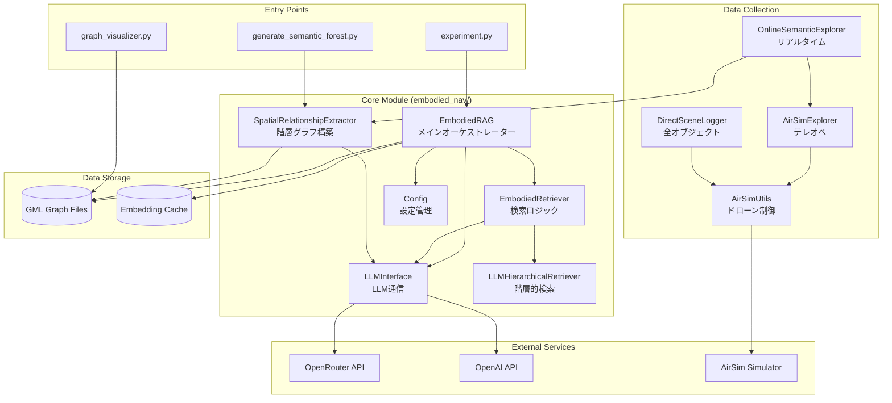
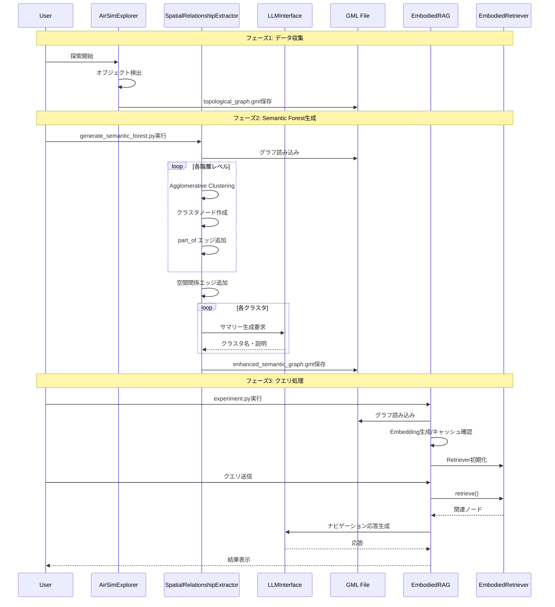
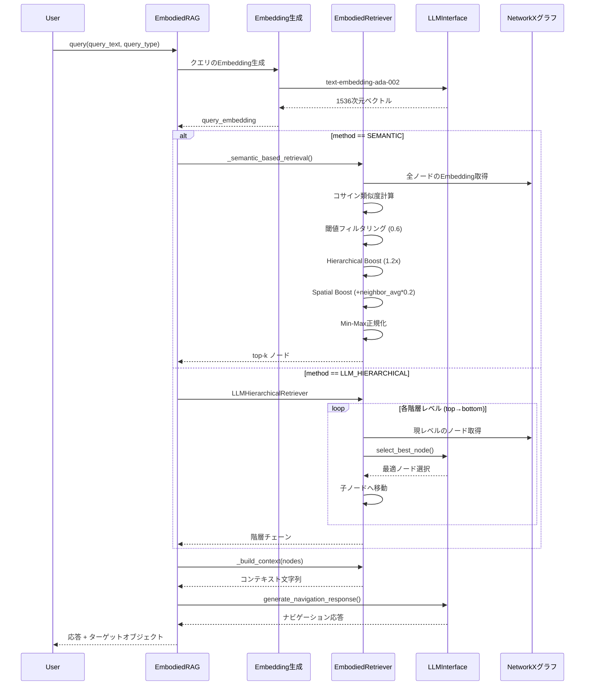
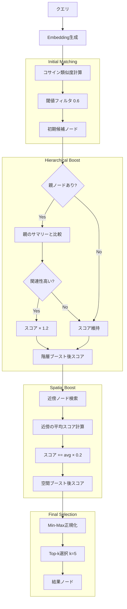
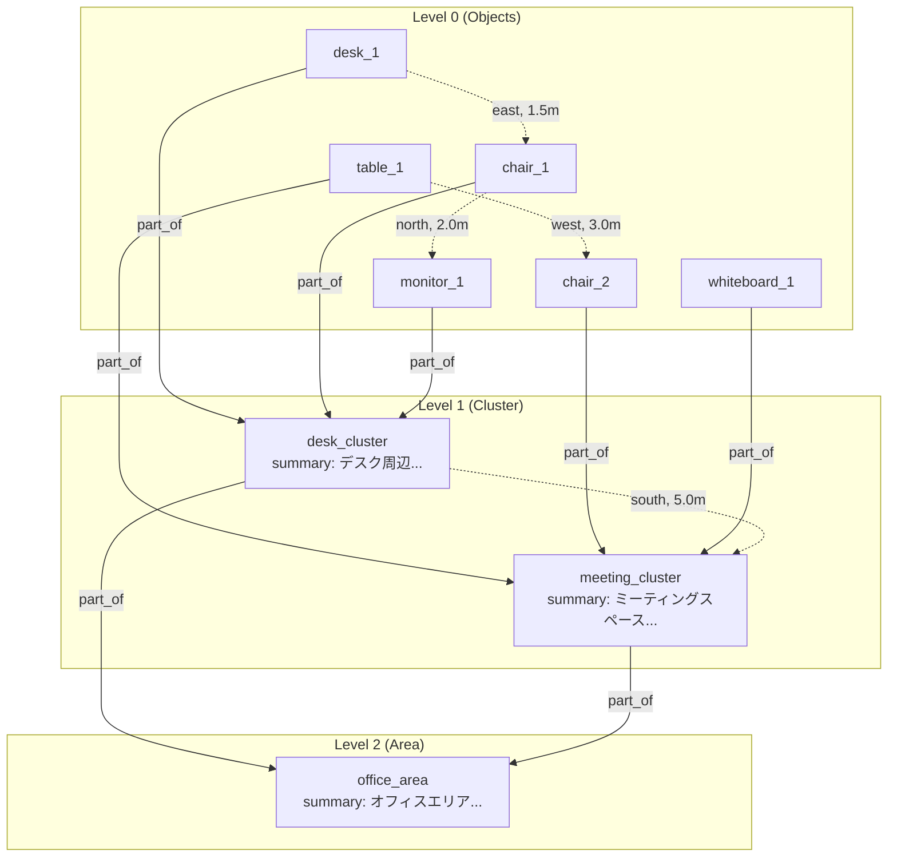
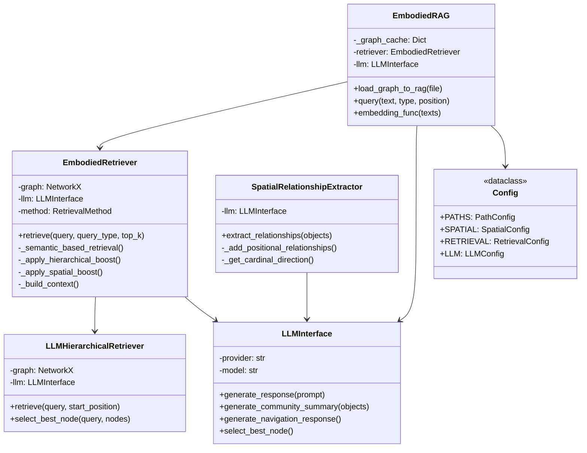
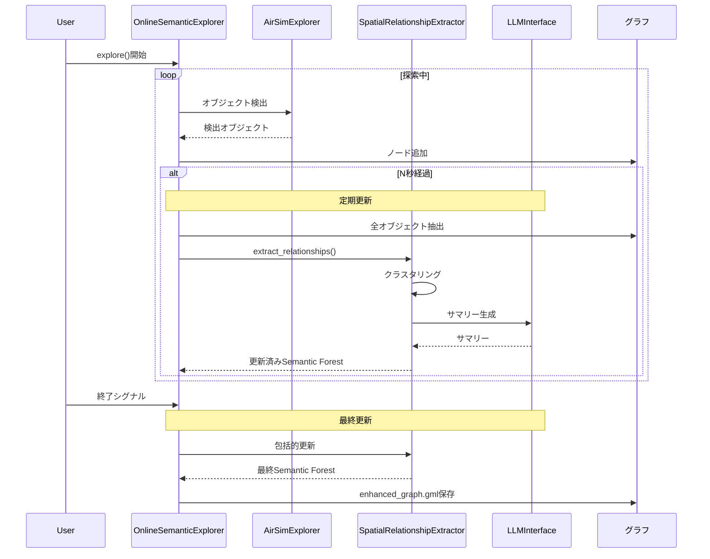

# Embodied RAG アーキテクチャ図

このドキュメントでは、Embodied RAGシステムの構造をシーケンス図とアーキテクチャ図で説明します。

## 1. 全体アーキテクチャ図

## 2. オフラインワークフロー シーケンス図

## 3. クエリ処理 詳細シーケンス図

## 4. Semantic Retrieval アルゴリズム図

## 5. グラフ構造図

## 6. クラス関係図

## 7. オンラインワークフロー シーケンス図

## 主要コンポーネント説明

| コンポーネント | ファイル | 役割 |
|--------------|---------|------|
| **EmbodiedRAG** | `embodied_rag.py` | メインオーケストレーター、グラフ読み込み、Embedding管理 |
| **EmbodiedRetriever** | `embodied_retriever.py` | 2つの検索方式(SEMANTIC/LLM_HIERARCHICAL)を提供 |
| **SpatialRelationshipExtractor** | `spatial_relationship_extractor.py` | 階層的クラスタリングとグラフ構築 |
| **LLMInterface** | `llm.py` | OpenRouter/OpenAI/vLLM対応のLLM通信 |
| **Config** | `config.py` | 全設定パラメータの一元管理 |

## 検索方式の比較

| 方式 | 速度 | 特徴 |
|-----|------|------|
| **SEMANTIC** | ~0.7秒 | コサイン類似度 + 階層/空間ブースティング |
| **LLM_HIERARCHICAL** | ~10秒 | LLMによる階層的ノード選択 |
